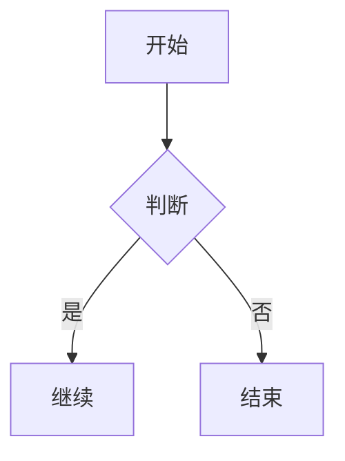

# Obsidian 知识库管理技能（融合增强版）

## 🎯 技能概述

本技能专门用于管理和扩展用户的 Obsidian 知识库。它保留用户现有的目录结构、YAML 风格、写作习惯和挂载目录写入偏好，同时融合 Obsidian 官方生态中的实用能力：

- **个性化知识库工作流**：按用户现有目录与模板创建、整理、维护笔记
- **Obsidian Markdown 增强**：支持 wikilink、embed、callout、block ID、Mermaid、数学公式等
- **网页摘抄清洗**：优先提取网页正文为干净 Markdown，再写入笔记
- **Canvas / Bases 支持**：可创建和编辑 `.canvas` / `.base` 文件
- **安全写入与校验**：针对挂载目录优先使用 shell / Python 原生写入，并在写入后验证落盘结果

## 📁 知识库结构

### 当前目录结构：
```
/var/minis/mounts/obsidian/
├── main/                    # 主知识库
│   ├── 知识库/              # 核心知识存储
│   │   ├── Linux/          # Linux 相关笔记
│   │   ├── 嵌入式/         # STM32 等嵌入式开发
│   │   ├── 工具/           # 开发工具教程
│   │   ├── 机器人/         # ROS 相关
│   │   └── 网络/           # 网络基础知识
│   ├── 就业面试本/         # 面试相关
│   ├── 新闻笔记/           # 时事新闻记录
│   ├── 日记/               # 日常记录
│   │   └── 随笔/           # 网页摘抄、感想、短文优先目录
│   ├── 项目/               # 项目相关
│   └── 收件箱/             # 临时收集
├── 就业面试本/              # 独立面试笔记
├── 新闻笔记/                # 独立新闻笔记
└── 知识库/                  # 独立知识库
```

### 笔记格式特点：
1. **YAML 前端元数据优先沿用现有中文字段风格**：
   ```yaml
   ---
   base: "[[计算机知识手册.base]]"
   分类: 操作系统
   标签: []
   创建日期: 2026-03-20
   最后修改: 2026-03-20
   状态: 已完成
   ---
   ```

2. **内容结构**：
   - 使用 `[[内部链接]]` 语法
   - 结构化标题（如 `## 1. 这是什么`）
   - 清晰的层次结构
   - 支持图片、PDF、音视频等附件嵌入
   - 支持 Callout、Mermaid、公式、脚注等 Obsidian 扩展语法

## 🛠️ 核心功能

### 1. 笔记创建与生成
- **智能路径选择**：根据主题自动选择合适目录
- **模板生成**：基于现有笔记格式生成统一模板
- **元数据填充**：自动填充分类、标签、日期、状态
- **内容结构化**：按照知识库风格组织内容
- **语法增强**：生成符合 Obsidian 风格的 Markdown

### 2. 笔记管理与维护
- **批量操作**：批量更新标签、状态、分类
- **链接管理**：自动检查和修复内部链接
- **资产管理**：处理图片等附件文件
- **格式标准化**：确保笔记格式统一
- **写入校验**：写入后回读验证，避免挂载目录假成功

### 3. 知识库分析
- **结构分析**：分析知识库完整性和覆盖率
- **内容统计**：统计各分类笔记数量、字数
- **关联发现**：发现笔记间的潜在关联
- **缺口识别**：识别知识库中的空白领域

### 4. 自动化工作流
- **学习笔记生成**：从学习资料生成结构化笔记
- **项目文档生成**：从项目代码生成文档
- **网页摘抄落库**：先清洗网页正文，再生成 Obsidian 笔记
- **定期维护**：自动整理和优化笔记库
- **备份检查**：集成备份和同步功能

### 5. Obsidian 扩展格式支持
- **Obsidian Markdown**：wikilink、embed、callout、注释、高亮、脚注
- **Canvas 文件**：创建和编辑 `.canvas`
- **Bases 文件**：创建和编辑 `.base`
- **图表与公式**：Mermaid、LaTeX 数学公式

## 🧭 工作原则

### 主原则：优先保留用户现有知识库风格
1. **优先保留中文 YAML 字段**，不要随意改成 `title`、`tags`、`date` 等英文字段
2. **优先保留既有目录结构**，不要为了“通用化”而改变用户路径习惯
3. **优先保留用户笔记风格**，简洁排版优先，不强行加入复杂样式
4. **优先保证落盘可靠性**，挂载目录写入时优先 shell / Python 原生写入并校验

### 辅原则：吸收 Obsidian 官方生态能力
1. **内部链接优先用 wikilink**：`[[笔记名]]`
2. **外部链接优先用 Markdown 链接**：`[标题](https://example.com)`
3. **需要强调内容时可用 callout**
4. **需要复用内容时可用 embed 或 block ID**
5. **涉及画布和数据库视图时，优先考虑 `.canvas` / `.base`**

## 📝 Obsidian Markdown 增强规范

### 1. Wikilink（内部链接）
```markdown
[[Note Name]]
[[Note Name|显示文本]]
[[Note Name#Heading]]
[[Note Name#^block-id]]
[[#当前笔记中的标题]]
```

使用原则：
- Vault 内部笔记优先使用 `[[wikilink]]`
- 外部网址使用 `[text](url)`
- 若用户已有命名风格，显示文本可适度简化，但不要破坏原笔记名

### 2. Block ID（块引用）
```markdown
这是一段可以被引用的内容。 ^my-block-id
```

适用场景：
- 复用知识点
- 精确引用某一段内容
- 为总结笔记、索引笔记建立精细链接

### 3. Embed（嵌入）
```markdown
![[Note Name]]
![[Note Name#Heading]]
![[image.png]]
![[image.png|300]]
![[document.pdf#page=3]]
```

适用场景：
- 在综述页嵌入已有笔记片段
- 嵌入图片、PDF 页面、已有资料
- 构建索引页、项目总览页

### 4. Callout（提示块）
```markdown
> [!note]
> 基础提示内容

> [!warning] 注意事项
> 这里是风险或常见错误

> [!faq]- 默认折叠
> 这里适合放可折叠问答
```

常用类型：
- `note`
- `info`
- `tip`
- `warning`
- `question`
- `example`
- `success`
- `bug`
- `danger`

适用场景：
- 学习笔记中的重点/易错点
- 项目文档中的注意事项
- 面试笔记中的高频问题

### 5. 其他 Obsidian 常用扩展
```markdown
==高亮内容==
%%隐藏注释%%
脚注示例[^1]

[^1]: 脚注内容
```

### 6. Mermaid 与数学公式
````markdown

````

```markdown
行内公式：$E = mc^2$

块公式：
$$
\frac{a}{b} = c
$$
```

适用场景：
- 学习笔记、项目流程说明
- 算法、工程原理、数学推导

## 🌐 网页摘抄与内容清洗工作流

当用户提供网页链接并希望保存到 Obsidian 时，优先采用以下流程：

1. **抓取网页正文**：优先使用 Defuddle 或等效正文提取方式，获取干净 Markdown
2. **去除噪声**：删除导航栏、广告、页脚、无关推荐等内容
3. **保留来源信息**：记录原始 URL、标题、摘抄日期
4. **结构化整理**：根据内容类型生成随笔、学习笔记或资料摘录
5. **写入合适目录**：
   - 随笔 / 感想 / 文章摘抄 → `/var/minis/mounts/obsidian/main/日记/随笔/`
   - 系统知识整理 → `/var/minis/mounts/obsidian/main/知识库/...`
   - 项目资料 → `/var/minis/mounts/obsidian/main/项目/...`
6. **落盘校验**：写入后回读验证内容是否真实存在

### 网页摘抄推荐结构
```markdown
---
标签:
  - 摘抄
创建日期: 2026-04-17
最后修改: 2026-04-17
状态: 已完成
来源: https://example.com/article
---

# 文章标题

## 摘要

## 原文摘录

## 我的想法

## 延伸链接
```

## 🎨 Canvas / Bases 支持

### 1. JSON Canvas（`.canvas`）
画布文件基础结构：
```json
{
  "nodes": [],
  "edges": []
}
```

支持内容：
- 文本节点（text）
- 文件节点（file）
- 链接节点（link）
- 分组节点（group）
- 节点连线（edges）

操作原则：
1. 编辑前先读取并解析 JSON
2. 为每个节点/边生成唯一 ID
3. 修改后验证 JSON 合法性
4. 检查 `fromNode` / `toNode` 是否都存在
5. 尽量保持布局整洁，节点间留出足够间距

适用场景：
- 知识点关系图
- 学习路径图
- 项目流程图
- 读书笔记结构图

### 2. Obsidian Bases（`.base`）
适用场景：
- 资料汇总视图
- 任务/项目追踪
- 分类筛选与统计
- 面试题或知识卡片的数据库式管理

操作原则：
1. 明确数据来源与字段含义
2. 先定义过滤规则、视图、汇总目标
3. 修改后验证语法与字段引用是否一致
4. 不因追求“数据库化”而破坏原有笔记可读性

## 📋 使用指南

### 基本操作流程：
1. **检查挂载状态**：确认 Obsidian 目录可访问
2. **分析需求**：判断是写新笔记、批量维护、网页摘抄、Canvas/Bases 编辑还是结构分析
3. **确认目标路径**：优先确认 vault、目录、文件名
4. **选择功能**：调用相应模块
5. **执行操作**：使用适当工具完成写入或修改
6. **验证结果**：检查文件是否真实存在、内容是否落盘、格式是否正确
7. **提供反馈**：向用户报告结果和后续建议

### 针对挂载目录的写入要求：
- **优先使用 shell / Python 原生写入**
- **写入后必须回读校验**
- **避免仅依赖 `file_write` 作为挂载目录最终写入方式**
- **批量修改前尽量备份或先做样本测试**

### 常用命令模式（示意）：
```bash
# 检查目录
ls -la /var/minis/mounts/obsidian/

# 查找笔记
find /var/minis/mounts/obsidian/ -name "*.md"

# 批量检索关键词
find /var/minis/mounts/obsidian/ -name "*.md" -exec grep -l "关键词" {} \;
```

## ⚙️ 技术实现

### 文件操作策略：
- **读取**：`file_read`、`cat`、Python
- **创建（普通目录）**：`file_write`
- **创建（挂载目录）**：优先 shell / Python 原生写入
- **编辑（普通目录）**：`file_edit`
- **编辑（挂载目录）**：优先 shell / Python 原生修改并验证
- **查找**：`find`、`grep`
- **校验**：写入后立即回读检查

### 路径处理：
```bash
OBSIDIAN_ROOT="/var/minis/mounts/obsidian"
MAIN_DIR="$OBSIDIAN_ROOT/main"
KNOWLEDGE_DIR="$MAIN_DIR/知识库"
DAILY_DIR="$MAIN_DIR/日记"
ESSAY_DIR="$DAILY_DIR/随笔"
PROJECT_DIR="$MAIN_DIR/项目"
INBOX_DIR="$MAIN_DIR/收件箱"
```

### 模板变量：
- `{{TITLE}}` - 笔记标题
- `{{CATEGORY}}` - 分类
- `{{TAGS}}` - 标签列表
- `{{DATE}}` - 创建日期
- `{{STATUS}}` - 状态（进行中/已完成）
- `{{SOURCE}}` - 来源网址（若适用）
- `{{SUMMARY}}` - 摘要（若适用）

## 🚨 注意事项

### 安全第一：
1. **备份意识**：重要操作前建议备份
2. **权限检查**：确保有写入权限
3. **预览功能**：修改前先预览变化
4. **逐步执行**：复杂操作分步进行

### 错误处理：
1. **路径验证**：操作前验证路径存在
2. **格式检查**：确保符合 Obsidian 格式
3. **回滚机制**：失败时提供恢复选项
4. **日志记录**：记录重要操作
5. **写入校验**：挂载目录必须验证是否真实落盘

### 风格一致性要求：
1. **不要轻易混用中英文 frontmatter 字段**
2. **优先沿用现有目录分类，不随意重构**
3. **生成内容时优先简洁清晰，而不是堆砌复杂语法**
4. **只有在确实增强可读性时才使用 callout、embed、Mermaid 等扩展能力**

## 📈 最佳实践

### 创建新笔记：
1. 先分析现有相似笔记的格式
2. 选择合适的模板与目标目录
3. 填充元数据和内容
4. 根据需要添加 wikilink / callout / embed
5. 验证格式正确性与落盘结果

### 网页摘抄：
1. 先提取正文 Markdown
2. 去除噪声内容
3. 保留来源信息
4. 整理为适合用户知识库风格的结构
5. 写入随笔或知识库目录
6. 回读验证

### 批量更新：
1. 先统计受影响笔记数量
2. 创建备份
3. 测试单个样本
4. 批量执行
5. 验证结果

### Canvas / Bases：
1. 先确认用户是否确实需要结构化视图
2. 小步创建与验证
3. 保持结构清晰、字段统一
4. 让画布/视图服务于笔记，而不是替代笔记本身

### 知识库分析：
1. 定期分析结构完整性
2. 识别知识缺口
3. 优化分类体系
4. 清理无效链接
5. 检查是否存在风格不一致的 metadata

## 🔧 扩展功能

### 脚本工具：
- `analyze-structure.py` - 知识库结构分析
- `batch-update.py` - 批量更新工具
- `generate-links.py` - 链接生成工具
- `check-consistency.py` - 一致性检查
- `extract-web-content.py` - 网页正文提取与清洗（建议新增）
- `validate-canvas.py` - Canvas 文件校验（建议新增）

### 模板库：
- `knowledge-base.md` - 知识库笔记模板
- `learning-note.md` - 学习笔记模板
- `project-doc.md` - 项目文档模板
- `daily-note.md` - 日常笔记模板
- `web-clipping.md` - 网页摘抄模板（建议新增）
- `canvas-note.md` - 画布说明模板（建议新增）

## 💡 使用示例

### 示例1：创建学习笔记
```
用户：帮我创建一个关于 Python 异步编程的学习笔记
步骤：
1. 确定分类：工具/Python
2. 选择模板：learning-note.md
3. 填充元数据：分类=编程，标签=[Python,异步]
4. 加入必要的 wikilink 和重点 callout
5. 保存到：知识库/工具/Python异步编程.md
6. 校验文件真实写入
```

### 示例2：批量更新标签
```
用户：给所有 Linux 笔记添加"系统"标签
步骤：
1. 查找所有 Linux 目录下的笔记
2. 读取每个笔记的 YAML 前端
3. 在标签列表中添加"系统"
4. 逐个修改并验证
5. 统计更新数量
```

### 示例3：网页摘抄保存到随笔
```
用户：把这篇文章保存到我的 Obsidian 随笔
步骤：
1. 提取网页正文 Markdown
2. 保留来源 URL 与文章标题
3. 生成简洁的摘抄结构
4. 写入：日记/随笔/xxx.md
5. 回读校验
```

### 示例4：生成 Canvas
```
用户：帮我把这组知识点做成 Obsidian Canvas
步骤：
1. 设计节点与连接关系
2. 生成 .canvas 基础 JSON
3. 添加文本节点、文件节点、连接边
4. 校验 JSON 和引用完整性
5. 保存并说明使用方法
```

---

## 🎉 融合增强说明

### 已增强能力：
1. **保留原有知识库管理工作流**：目录、模板、分类、分析能力继续有效
2. **补充 Obsidian Markdown 规范**：wikilink、embed、callout、block ID 等
3. **补充网页清洗摘抄流程**：更适合保存文章、教程、网页资料
4. **新增 Canvas / Bases 支持说明**：扩展到 `.canvas` / `.base`
5. **强化挂载目录写入策略**：优先原生写入并做落盘校验

### 文件清单：
```
obsidian-knowledge-manager/
├── SKILL.md                    # 主技能文件
├── SKILL.md.bak                # 融合前备份
├── templates/                  # 专业模板
│   ├── knowledge-base.md      # 知识库笔记模板
│   ├── learning-note.md       # 学习笔记模板
│   ├── project-doc.md         # 项目文档模板
│   └── daily-note.md          # 日常笔记模板
├── scripts/                   # 实用脚本
│   ├── analyze-structure.py   # 知识库结构分析脚本
│   └── test-skill.py          # 技能测试脚本
└── references/                # 详细参考文档
    ├── directory-structure.md # 目录结构说明
    ├── metadata-schema.md     # 元数据规范
    └── usage-examples.md      # 使用示例
```

### 立即使用：
现在你可以使用以下关键词触发技能：
- "创建 Obsidian 笔记"
- "管理我的知识库"
- "分析笔记结构"
- "批量更新标签"
- "生成学习笔记"
- "整理 Obsidian"
- "保存网页到 Obsidian"
- "生成 Obsidian Canvas"
- "编辑 .canvas 文件"
- "创建 .base 视图"
- "帮我加 wikilink / callout / embed"

---

**技能状态**：✅ 已融合增强
**融合时间**：2026-04-17
**版本**：1.1.0
**定位**：个人知识库工作流 + Obsidian 语法增强 + 网页摘抄 + Canvas/Bases 支持
