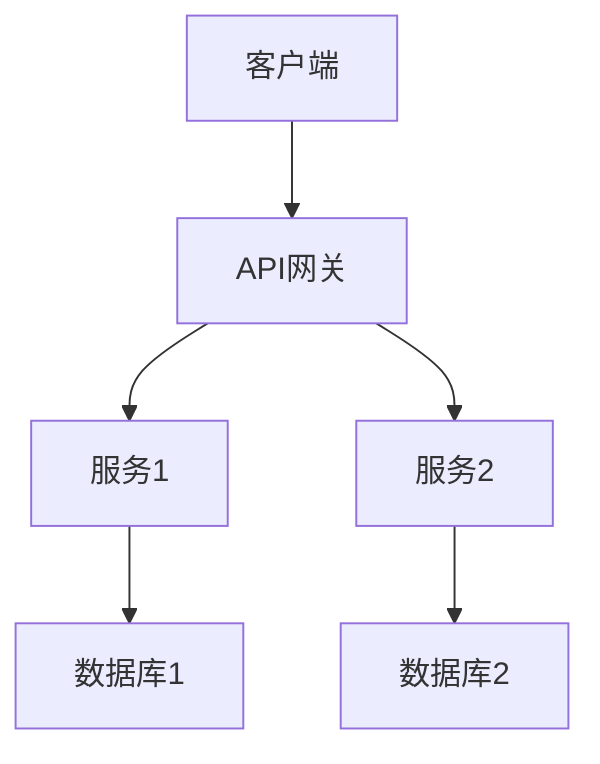

# {{PROJECT_NAME}} 项目文档

## 📋 项目概览

### 项目简介
{{PROJECT_DESCRIPTION}}

### 项目目标
- 目标1
- 目标2
- 目标3

### 项目范围
**包含**：
- 功能1
- 功能2
- 功能3

**不包含**：
- 非功能1
- 非功能2

## 🎯 功能需求

### 核心功能
| 功能模块 | 功能描述 | 优先级 | 状态 |
|----------|----------|--------|------|
| 功能1 | 描述 | 高 | 进行中 |
| 功能2 | 描述 | 中 | 待开始 |
| 功能3 | 描述 | 低 | 已完成 |

### 用户故事
**作为** [用户角色]
**我希望** [功能需求]
**以便于** [价值收益]

**验收标准**：
- [ ] 标准1
- [ ] 标准2
- [ ] 标准3

## 🏗️ 技术架构

### 系统架构图


### 技术选型
- **前端**：技术栈
- **后端**：技术栈
- **数据库**：数据库类型
- **部署**：部署方式
- **监控**：监控工具

### 目录结构
```
project/
├── src/                    # 源代码
│   ├── frontend/          # 前端代码
│   ├── backend/           # 后端代码
│   └── common/            # 公共代码
├── docs/                  # 文档
├── tests/                 # 测试代码
├── config/                # 配置文件
└── scripts/               # 脚本文件
```

## 🔧 开发指南

### 环境搭建
```bash
# 1. 克隆项目
git clone {{REPO_URL}}

# 2. 安装依赖
cd project
npm install  # 或 pip install -r requirements.txt

# 3. 配置环境
cp .env.example .env
# 编辑 .env 文件

# 4. 启动服务
npm run dev  # 或 python app.py
```

### 代码规范
- **命名规范**：说明
- **代码风格**：说明
- **提交规范**：说明
- **文档要求**：说明

### 测试指南
```bash
# 运行单元测试
npm test

# 运行集成测试
npm run test:integration

# 生成测试报告
npm run test:coverage
```

## 📊 部署运维

### 部署流程
1. **开发环境**：部署步骤
2. **测试环境**：部署步骤
3. **生产环境**：部署步骤

### 配置文件
```yaml
# config.yaml 示例
database:
  host: localhost
  port: 5432
  name: mydb
  user: admin

server:
  port: 3000
  debug: false
```

### 监控告警
- **监控指标**：CPU、内存、磁盘、网络
- **日志收集**：ELK 或类似方案
- **告警规则**：阈值设置
- **应急预案**：故障处理流程

## 📝 API 文档

### 接口列表
| 方法 | 路径 | 描述 | 权限 |
|------|------|------|------|
| GET | /api/users | 获取用户列表 | 需要认证 |
| POST | /api/users | 创建用户 | 需要认证 |
| PUT | /api/users/:id | 更新用户 | 需要认证 |
| DELETE | /api/users/:id | 删除用户 | 需要认证 |

### 请求示例
```bash
curl -X GET "https://api.example.com/users" \
  -H "Authorization: Bearer token"
```

### 响应示例
```json
{
  "code": 200,
  "message": "success",
  "data": [
    {
      "id": 1,
      "name": "用户1",
      "email": "user1@example.com"
    }
  ]
}
```

## 🐛 故障排除

### 常见问题
| 问题现象 | 可能原因 | 解决方案 |
|----------|----------|----------|
| 问题1 | 原因1 | 解决1 |
| 问题2 | 原因2 | 解决2 |
| 问题3 | 原因3 | 解决3 |

### 调试方法
```bash
# 查看日志
tail -f logs/app.log

# 检查服务状态
systemctl status myservice

# 监控资源使用
htop
```

## 📈 项目进度

### 里程碑
| 里程碑 | 计划完成 | 实际完成 | 状态 |
|--------|----------|----------|------|
| 需求分析 | 2026-01-15 | 2026-01-14 | ✅ |
| 设计阶段 | 2026-01-30 | 2026-01-28 | ✅ |
| 开发阶段 | 2026-03-15 | 2026-03-20 | 🔄 |
| 测试阶段 | 2026-03-30 | - | ⏳ |
| 上线发布 | 2026-04-15 | - | ⏳ |

### 任务看板
- **待办**：任务列表
- **进行中**：任务列表
- **已完成**：任务列表
- **阻塞中**：任务列表

## 📁 文档索引

### 相关文档
- [[需求文档]]
- [[设计文档]]
- [[测试文档]]
- [[部署文档]]

### 会议记录
- [[项目启动会]]
- [[需求评审会]]
- [[技术方案评审]]

### 决策记录
- [[技术选型决策]]
- [[架构设计决策]]
- [[产品功能决策]]

## 👥 团队协作

### 沟通渠道
- **日常沟通**：Slack/钉钉
- **代码评审**：GitHub/GitLab
- **文档协作**：Notion/Confluence
- **会议记录**：腾讯会议/Zoom

### 工作流程
1. **需求提出**：流程说明
2. **任务分配**：流程说明
3. **开发实现**：流程说明
4. **代码评审**：流程说明
5. **测试验证**：流程说明
6. **部署上线**：流程说明

---

> 文档版本: {{VERSION}}
> 最后更新: {{DATE}}
> 项目状态: {{STATUS}}